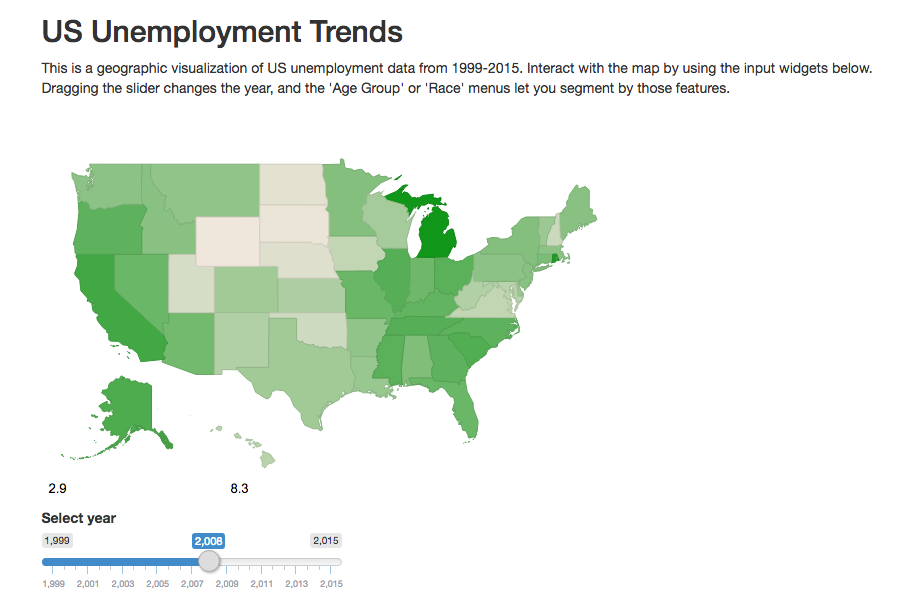

## About the application

</img>

The unemployment data map is a geographic visualization of US unemployment data from 1999-2015.  Users can interact with the map by using input widgets for changing 'Year', 'Age Group' or 'Race' menus.  The application relies on the `googleVis` library, and a simple reactive function to manipulate the data presented on the map. [See it live.](https://stvauyeung.shinyapps.io/us_labor_map_app/)

---

## Data sources and transformation

The data comes from the [Bureau f Labor Statistics website](http://www.bls.gov/cps/tables.htm).  Original datasets can be found in the `datasets` directory of the project repository, which is [available on github](https://github.com/stvauyeung/us-unemployment-map).  These files were combined and transformed using MS Excel, adding additional factors columns for 'Year', 'Age', and 'Race'.  Observations with 'Gender' specific segmentations were removed.  This new dataset is saved as `mapData.csv`, under the app's `data` directory.

---

## Slicing the data using user input

By using reactive statements, the application is able to listen for user input, and instantly update the dataset represented through the Google Vis map.  Below is the filter function used to dynamically update the map data.

```{r}
filterData <- function(mapData, year, age, race) {
    newData <- mapData[mapData$Year == year,]
    newData <- newData[newData$Age == age,]
    newData <- newData[newData$Race == race,]
    return(newData)
}
```

--- 

## Conclusion

Open data sources are available all over the internet.  Tools like Shiny make it easy to build interactive visualizations to give people new ways to interact with and understand complex data.
